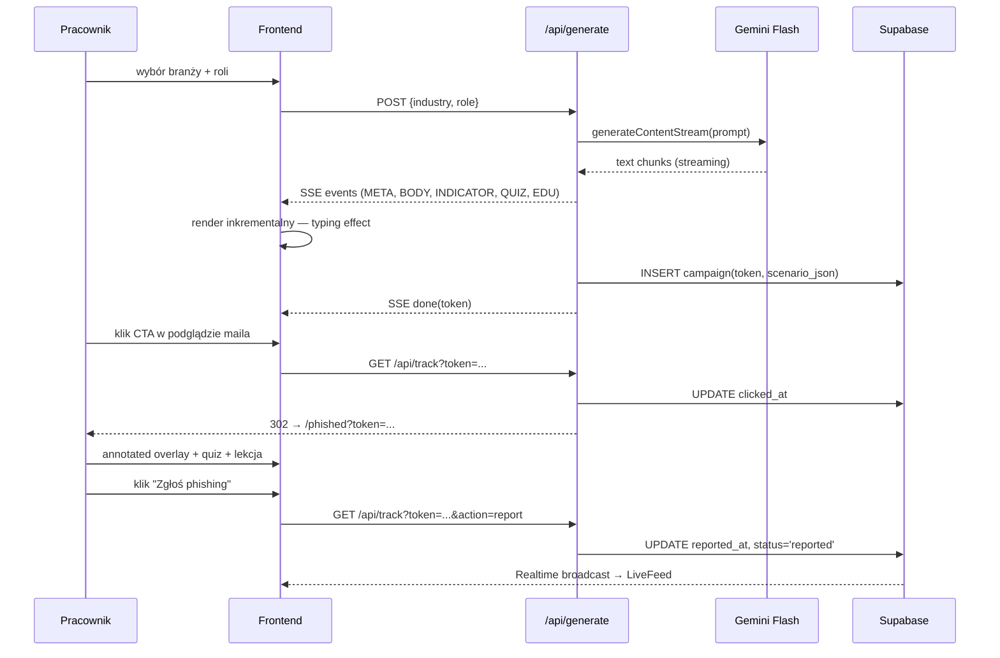

# CyberDrill

> Phishing który wygląda jak prawdziwy atak. Bo nim jest.

CyberDrill to platforma symulacji ataków phishingowych dedykowana firmom przemysłowym (aerospace, pharma, energy, manufacturing, fintech). AI generuje spersonalizowane scenariusze pod konkretną branżę i rolę zawodową — w terminologii inżyniera OT, nie generycznego korpomaila. Po kliknięciu pracownik trafia na sekwencyjną edukację z annotowanym overlayem maila, quizem i gamifikacją. CISO widzi wyniki w czasie rzeczywistym i eksportuje raport zgodności **NIS2 Art. 21.2(g)** jednym kliknięciem.

PoC zbudowany jako zadanie stażowe dla **Seargin** (Gdańsk).

---

## Problem

- **64% wzrostu** ataków ransomware na sieci OT w 2025 r. — **3 300 firm przemysłowych** zaatakowanych *(Dragos 2026 OT Cybersecurity Year in Review)*
- **82,6% maili phishingowych** jest generowanych przez AI — 4,5× skuteczniejszy niż tradycyjny phishing *(KnowBe4 Phishing Threat Trends 2025)*
- **UKSC 2.0** obowiązuje od 3 kwietnia 2026 r.: kary do **100 mln PLN** + osobista odpowiedzialność finansowa zarządu do **300% wynagrodzenia miesięcznego**

Istniejące platformy (KnowBe4, Hoxhunt, Keepnet) opierają się na statycznych bibliotekach szablonów — ich treści OT są pisane przez copywriterów, nie generowane w czasie rzeczywistym pod konkretną rolę i aktualną podatność CVE. Inżynier obsługujący SIMATIC S7-1500 i WinCC nie odnajduje się w szablonie "Twoje konto Microsoft zostało zablokowane".

---

## Rozwiązanie

AI (Gemini Flash) generuje unikalny phishing realistyczny dla konkretnej branży i roli, używa look-alike domen prawdziwych dostawców (Siemens, Honeywell, Veeva, ABB, Schneider Electric). Po kliknięciu serwuje annotowaną edukację z quizem, punktami i raportowaniem do dashboardu CISO w czasie rzeczywistym.

---

## Live demo

> **Vercel:** _link po deployu_

Lokalnie (~3 min setup):

```bash
npm install
cp .env.example .env.local   # uzupełnij klucze — patrz sekcja niżej
npm run dev
```

Otwórz `http://localhost:3000`.

### Zmienne środowiskowe (`.env.example`)

```
GEMINI_API_KEY=              # Google AI Studio → makersuite.google.com
NEXT_PUBLIC_SUPABASE_URL=    # Project URL z Supabase dashboard
NEXT_PUBLIC_SUPABASE_ANON_KEY=
SUPABASE_SERVICE_ROLE_KEY=   # Settings → API → service_role (tylko server-side)
NEXT_PUBLIC_APP_URL=http://localhost:3000
```

> **Ważne przed demo:** Pierwsze wywołanie Gemini na cold Edge runtime może trwać 15–30s. Pre-warm: `curl -X POST [URL]/api/generate -H "Content-Type: application/json" -d '{"industry":"aerospace","role":"inzynier_automatyki"}'` na 30s przed startem demo.

---

## Architektura

```mermaid
graph LR
  U[Pracownik] -->|/generate| FE[Next.js 16 App Router]
  FE -->|POST /api/generate\nEdge Runtime| EDGE[Edge Function]
  EDGE -->|generateContentStream| GEMINI[Gemini Flash API]
  GEMINI -.->|SSE chunks| EDGE
  EDGE -->|line-prefixed parser\nMETA/BODY/INDICATOR/QUIZ/EDU| EVENTS[StreamEvents]
  EVENTS -.->|SSE| FE
  EDGE -->|INSERT campaign + token| DB[(Supabase Postgres)]
  U -->|klik CTA w podglądzie| TRACK[/api/track]
  TRACK -->|UPDATE clicked_at| DB
  TRACK -->|302 redirect| PHISHED[/phished\nannotated overlay + quiz + lekcja]
  DB -.->|Realtime WebSocket| FEED[LiveFeed na /generate i /dashboard]
  DASH[/dashboard — widok CISO] --> PDF[jsPDF NIS2 PDF\nArt. 21.2g]
```

### Przepływ danych — sekwencja



---

## Stack technologiczny

- **Next.js 16** (App Router, TypeScript, Edge runtime na `/api/generate`)
- **Tailwind CSS v4** (dark theme, CSS custom properties)
- **Gemini Flash** przez `@google/genai` SDK — streaming SSE, structured output via line-prefix parser
- **Supabase** — Postgres + Realtime (WebSocket dla LiveFeed na `/generate` i `/dashboard`)
- **framer-motion** — animacje landing page, whileInView, stagger variants
- **Recharts** (dynamic import, lazy load) — wykres trendu phish-prone %
- **jsPDF + jspdf-autotable** — raport NIS2 z polskim fontem (Roboto embedded, ~700KB)
- **canvas-confetti** — gamifikacja na `/phished` po zgłoszeniu phishingu
- **lucide-react** — ikony

---

## Znane ograniczenia (zakres PoC)

| Ograniczenie | Szczegół |
|---|---|
| **Brak autoryzacji** | Tabela `campaigns` jest publiczna dla anon (RLS off) — każdy z tokenem może odczytać kampanię. Świadoma decyzja dla PoC. |
| **Dashboard = seed data** | Dane "Acme Industrial Sp. z o.o." (metryki, trend, działy) są statyczne w `lib/dashboard-data.ts`. Aplikacja nie agreguje danych z prawdziwych kampanii na skalę. |
| **Hardcoded polski** | Wszystkie stringi UI w `lib/copy.ts`. Przygotowane strukturalnie pod next-intl, ale i18n nie jest zainstalowane. |
| **Desktop-first** | Mobile odpada do single-column layoutu, nie jest polerowany. |
| **Brak walidacji `.env`** | Aplikacja nie weryfikuje poprawności kluczy API przy starcie — może crashować w połowie generowania przy błędnych kluczach. |
| **Brak fallbacku AI** | Gdy Gemini nie odpowie, użytkownik widzi komunikat błędu bez możliwości retry. Pre-warm endpointu przed demo zmniejsza ryzyko cold startu. |
| **PDF browser-side** | Roboto font (~700KB) jest bundlowany po stronie klienta. W produkcji PDF powinien być generowany server-side. |
| **Brak rate limitingu** | `/api/generate` nie ma throttlingu — PoC zakłada kontrolowane środowisko demo. |
| **Click-only mode** | Industry standard (KnowBe4 default): kliknięcie = "got phished". Credential capture (fake login) to opcja Tier B — świadoma decyzja, w roadmapie. |
| **Gemini cold start** | Pierwsze wywołanie Edge + Gemini może trwać 15–30s. Pre-warm przed demo jest wymagany. |

---

## Roadmap (post-PoC)

1. **Biblioteka szablonów** — gotowe scenariusze oparte na prawdziwych atakach OT, które AI dostosowuje do klienta zamiast generować od zera przy każdym żądaniu
2. **Spersonalizowane ataki per pracownik** — integracja z Active Directory, historia kliknięć i indywidualny wskaźnik ryzyka dla każdego użytkownika
3. **Wiele kanałów ataku** — symulacje phishingu przez SMS, Microsoft Teams i fałszywe połączenia głosowe z deepfake'iem głosu przełożonego
4. **Fałszywa strona logowania** — po kliknięciu pracownik trafia na podrobioną stronę logowania (M365, Okta) — opcjonalny tryb dla zaawansowanych kampanii
5. **Automatyczne śledzenie nowych zagrożeń** — integracja z bazami threat intelligence, która automatycznie tworzy scenariusze na podstawie świeżych ataków OT wykrytych w sieci

---

## Twórca

**Jan Bartnicki** · staż Seargin 2026 · Next.js + Gemini Flash + Supabase
